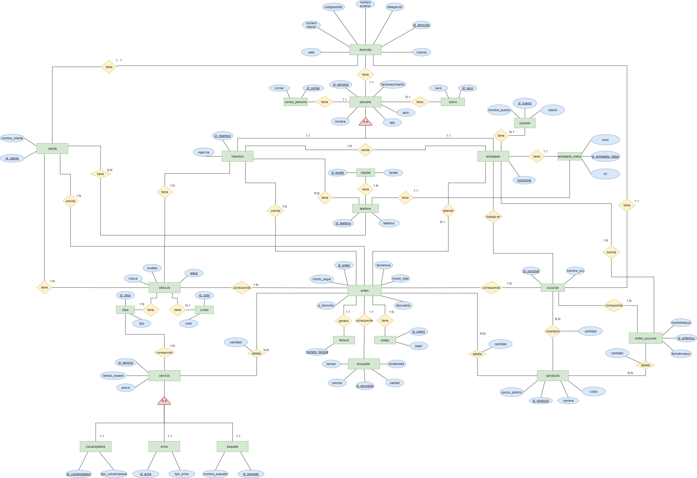
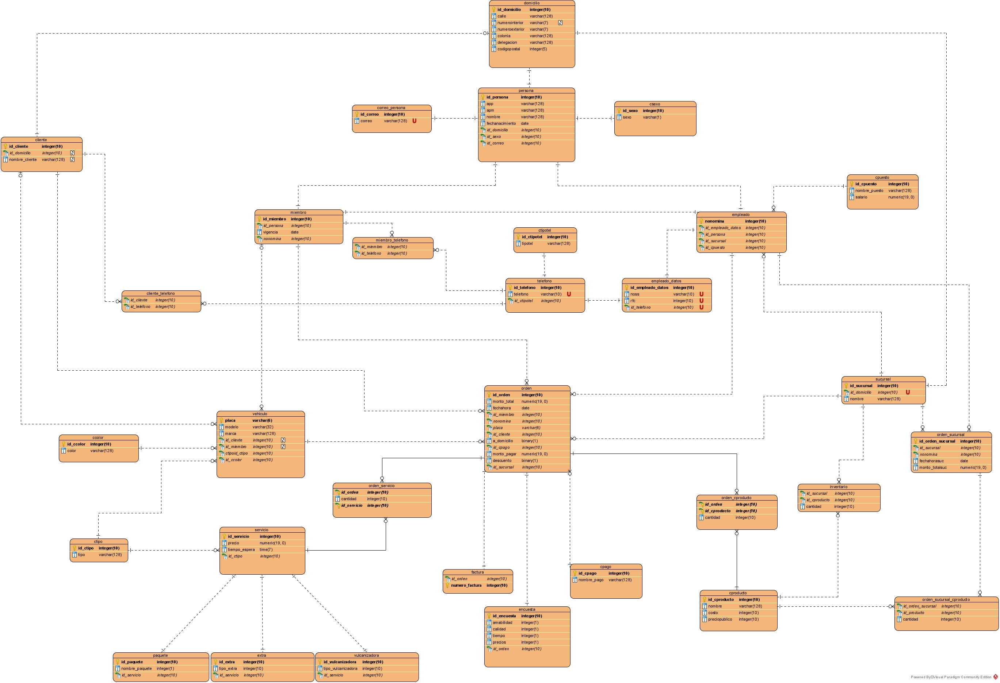

# Database design

This repository shows the design of a relational database for a car washing business. This is the work of Phys. Adán Castillo and Act. Gabriela Caire.

Both DDL (data definition language) and DML (data manipulation language) are used. The design of the database followed six steps:

1. Requirements analysis, including a BPMN (Business Process Model and Notation). This analysis is not in the repository but you can contact us if you're interested in reading it.
2. Design, through a UML (Unified Modeling Language) diagram
3. [Implementation](https://github.com/ACGuerrero/DataBase_design/tree/main/database) in PostreSQL
4. Testing: data to fill the database was [randomly generated through python scripts](https://github.com/ACGuerrero/DataBase_design/tree/main/data).

## Entity Relationship diagram
You can find this diagram on the [diagrams](https://github.com/ACGuerrero/DataBase_design/tree/main/diagrams) section.

## Unified Modeling Language diagram
You can find this diagram on the [diagrams](https://github.com/ACGuerrero/DataBase_design/tree/main/diagrams) section.

